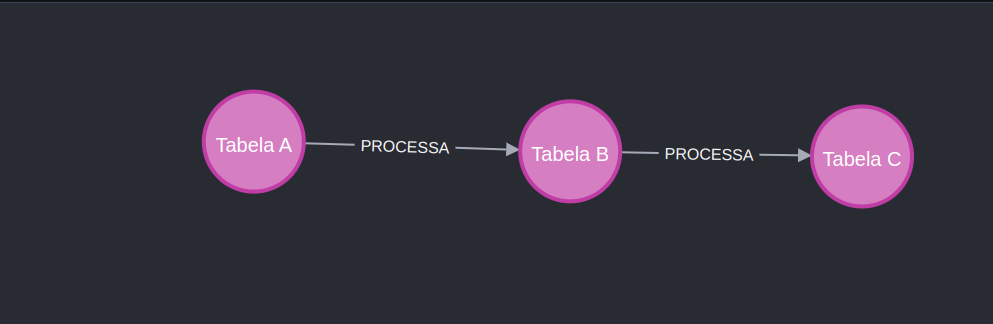

# javaneo4j

## criando nós e arestas no neo4j  
```sh
CREATE (:Tabela {nome: 'Tabela A'})
CREATE (:Tabela {nome: 'Tabela B'})
CREATE (:Tabela {nome: 'Tabela C'})
MATCH (a:Tabela {nome: 'Tabela A'}), (b:Tabela {nome: 'Tabela B'})
CREATE (a)-[:PROCESSA]->(b)
MATCH (b:Tabela {nome: 'Tabela B'}), (c:Tabela {nome: 'Tabela C'})
CREATE (b)-[:PROCESSA]->(c)
```

